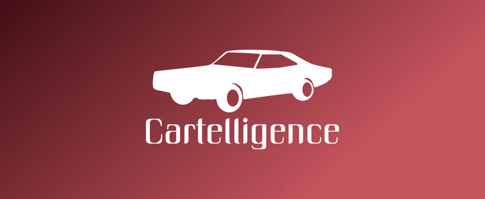
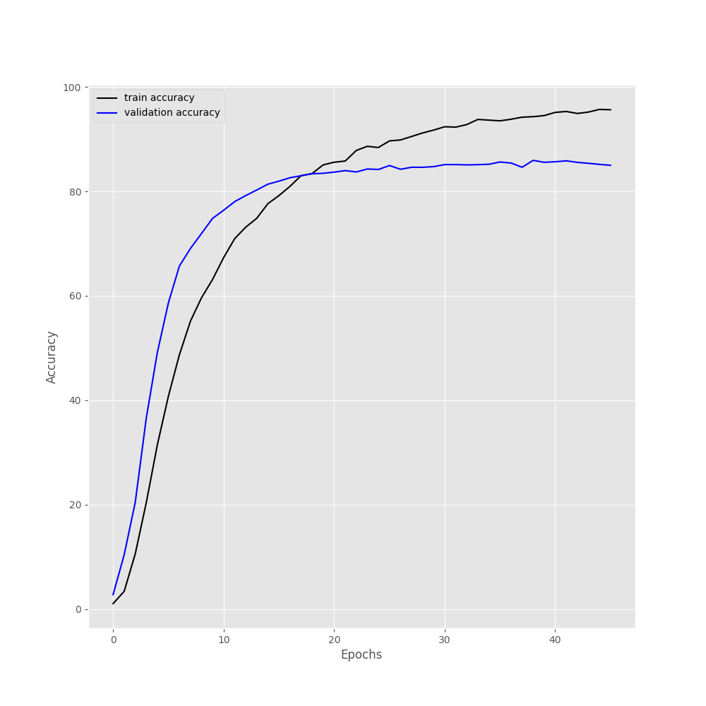
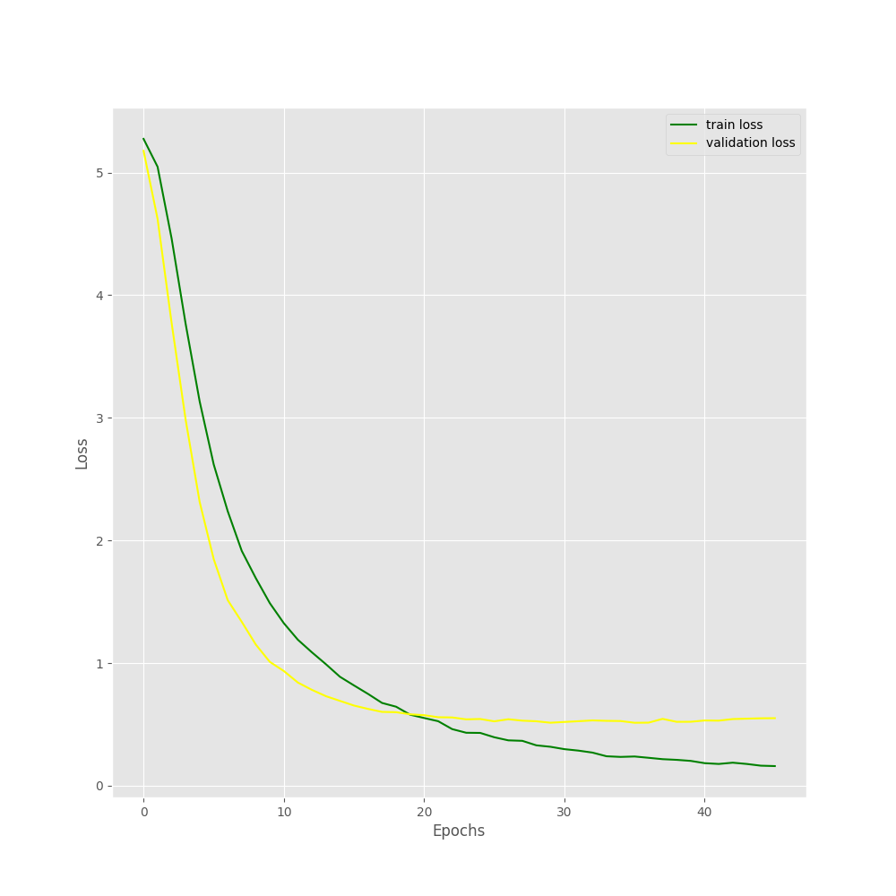
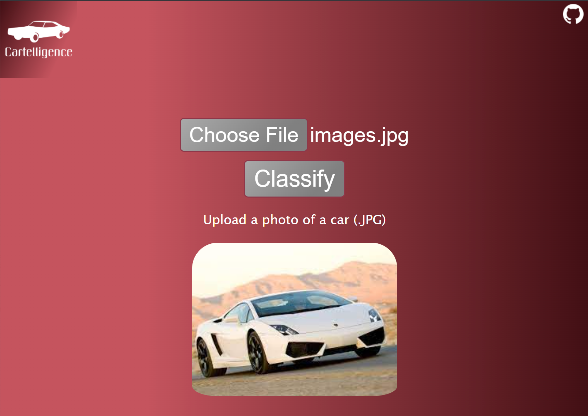
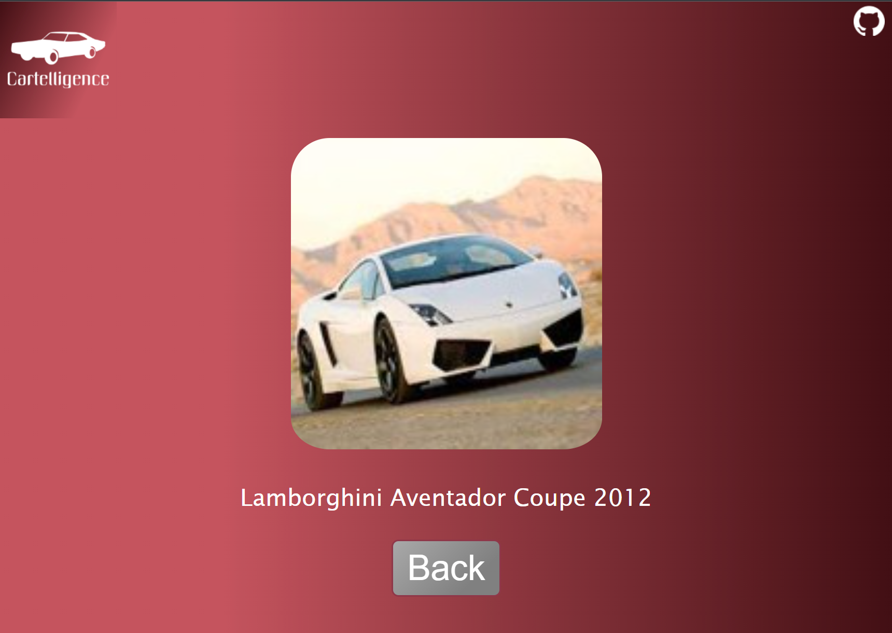

  

# About
CarTelligence is an application designed for classifying vehicles by their make, model, and year using a machine learning model. This application operates within a specific scope, primarily focusing on the Stanford Car Dataset, which is composed of 16,185 images of 196 classes of cars with models up to the year 2012. My mission with CarTellligence is to satisfy curiosity by providing users with the ability to identify vehicles accurately. However, its practical applications extend beyond curiosity, including scenarios where users may need to capture images of vehicles, especially in cases where a license plate is not visible. This capability can be invaluable in providing authorities with a more comprehensive description of vehicles [Visit CarTelligence](https://cartelligence.up.railway.app/) to try it out.

# Machine Learning Model
I utilized a pre-trained model built upon the ResNet-50 neural network. My choice of ResNet-50 was driven by its accuracy and synergy with PyTorch compared to alternatives such as VGG-16, and other neural networks. The training process incorporated transfer learning techniques including feature extraction and fine-tuning. The Stanford Car Dataset was used to train a new classifier alongside the last layers of the pre-trained ResNet-50 model.  

  
  

# Features
* Quick and accurate vehicle predictions
* Intuitive and easy-to-navigate website
* Accessible on various mobile devices

# Requirements 
* A stable internet connections 
* Any device capable of web browsing and uploading images
* Running the program locally will be discussed later

# Usage 
1. Visit [https://cartelligence.up.railway.app](https://cartelligence.up.railway.app/).
2. Upload an image of a vehicle using the provided form, a preview of the image will appear below the form.

  

3. Once the image has appeared, click the "Classify" button and after a few seconds you will receive the classification results:

  

4. On this page, users can navigate back and predict another vehicle.

# Technology
## Python
* Django
  * Leveraged Django framework to create and render the front end of the application, custom forms were created for user uploads
* PyTorch 
  * Provided a machine learning framework for transfer learning and fine-tuning of a pre-trained ResNet-50 model
* Pillow
  * Utilized to manipulate images, aiding in compression for server stability
## ResNet-50
* Developed a new classifier interconnected with the final layers of the pre-trained ResNet-50 model (based on ImageNet) for vehicle image predictions
## HTML
* Built the foundation for the website's graphical interface and incorporated a custom Django form
## CSS
* Styled the website with a seamless design focused on accessibility
## Javascript
* Implemented dynamic effects to the website including picture pop-ups and error message displays
## Stanford Car Dataset
* Trained the model on a dataset consisting of 16,185 images of 196 cars with the models up to the year 2012, citations for dataset usage are provided below
## Railway
* Used to deploy application 

# Local machine
1. Ensure you have a Python interpreter of your choice installed.
2. Install all Python libraries listed in the requirements.txt file.
3. Navigate to the downloaded repository using a terminal.
4. Run the following command: python manage.py runserver.
5. A local host deployment will activate, and you can access the site as usual until you shut down the terminal.

# Contributions 
CarTelligence is an open-source project and would benefit from additional contributions from the community that enhance vehicle classification. 

# Future 
In the future, CarTelligence may expand with more insight into individual classifications some features include mileage, price, and model features. 
Additionally, a model expansion and overhaul will be needed to classify vehicles up to the present day, encompassing all vehicles on the road. 

# Citations 
Jonathan Krause, Michael Stark, Jia Deng, Li Fei-Fei

4th IEEE Workshop on 3D Representation and Recognition, at ICCV 2013 (3dRR-13). Sydney, Australia. Dec. 8, 2013.
